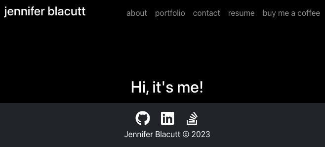

# React Portfolio

  

  ## Description
  My personal web portfolio made using React. This single-page application can be used to share projects and other information with potential employers and clients.
  
  Technologies used: React, JavaScript, Bootstrap

  ## Table of Contents
  - [Installation](#installation)
  - [Usage](#usage)
  - [Tests](#tests)
  - [Contributors](#contributors)
  - [Contact/Questions](#contact/questions)
  - [License](#license)

  ## Installation
  Packages required to run this app are: Run `npm i` to install dependencies.
  
  ## Usage
  Uses for this app: For portfolios and other single-page applications.

  ## Tests
  To test, run the following command: `npm start`

  ## Contributors
  Jennifer Blacutt

  ## Contact/Questions
  If you have any questions regarding this project, please reach me via the following methods:
 - Github: [itsjennyb](https://github.com/itsjennyb)
 - Email: [jennifer@blacutt.com](mailto:jennifer@blacutt.com)

  ## License
  This project is licensed under the MIT License.
  For more information, please visit: [MIT Explained](https://choosealicense.com/licenses/mit/)